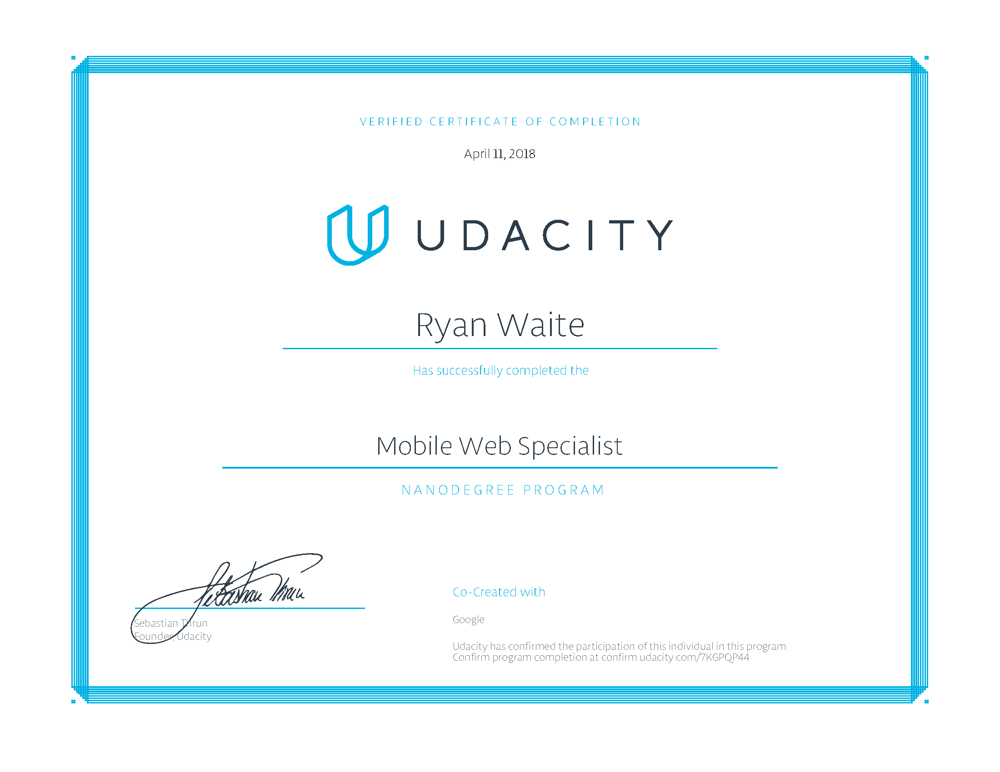

# Udacity
## Nanodegree Program
#### Mobile Web Specialist
https://www.udacity.com/course/mobile-web-specialist-nanodegree--nd024

___

> Prepare for Google's Mobile Web Specialist certification with courses from Google.
  
> As a graduate of this program, you'll be job-ready for Mobile Web Developer roles. In addition, you'll be fully prepared to earn the Google Mobile Web Specialist Certification, offered directly by Google.
  
> We built this Nanodegree program in partnership with Google for students with intermediate front-end web development skills who want to become professional mobile web developers. By the end of this program, you’ll have built a performant mobile web app project to show employers.
  
“We are building this curriculum with Udacity because we believe it reflects what developers everywhere should know.”
  — PETER LUBBERS, SENIOR PROGRAM MANAGER FOR DEVELOPER TRAINING AT GOOGLE

This was an amazing program! I learned the following:

* Responsive Web Design Fundamentals
* Responsive Images
* Web Accessibility
* Asynchronous JavaScript Requests
* ES6 JavaScript Improved
* Offline Web Applications
* Web Tooling and Automation

Deployed on heroku: https://rmw-mobile-web-specialist.herokuapp.com/

---
# Ryan M. Waite
### Web / Mobile Developer
